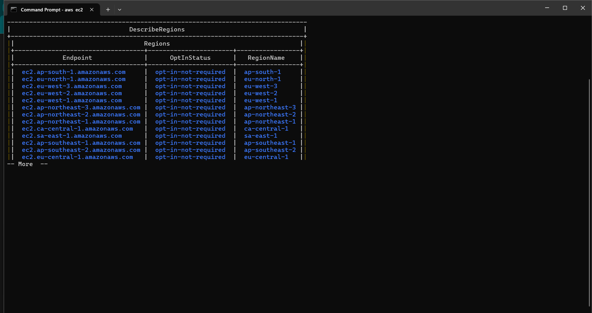

# Project Documentation: Setting Up Secure Authentication to AWS API

## Introduction
This project involved setting up secure authentication to AWS APIs, enabling the creation of EC2 instances and S3 buckets programmatically. The task required creating an IAM role, policy, and user with programmatic access credentials, followed by installing and configuring the AWS CLI.

## Steps Taken
###  1. Creating an IAM Role
- Purpose: The IAM role encapsulates the permissions required for automating tasks using the AWS API.

- Steps:
    - Logged in to the AWS Management Console.
    - Navigated to IAM Dashboard > Roles.
    - Clicked Create Role.
    - Selected AWS Service as the trusted entity type.
    - Chose EC2 to allow EC2 instances to assume the role (can vary depending on use case).
    - Clicked Next: Permissions and skipped adding permissions at this stage (permissions were later added using policies).
    - Named the role automation_role and created it.


### 2. Creating an IAM Policy
- Purpose: The IAM policy defines the permissions required to manage EC2 instances and S3 buckets.

- Steps:
    - Navigated to IAM Dashboard > Policies.
    - Clicked Create Policy and switched to the JSON tab.
    - Added the following JSON to define full access permissions for EC2 and S3:

        ```bash
        {
        "Version": "2012-10-17",
        "Statement": [
            {
            "Effect": "Allow",
            "Action": [
                "ec2:*",
                "s3:*"
            ],
            "Resource": "*"
            }
        ]
        }
        ```

    - Clicked Next and reviewed the policy.
    - Named the policy automation_policy and created it.


### 3. Creating an IAM User
- Purpose: The IAM user automation_user was created for programmatic access to AWS services.

- Steps:
    - Navigated to IAM Dashboard > Users.
    - Clicked Add Users and entered the username as automation_user.
    - Selected Programmatic access for access type.
    - Attached the automation_policy to this user during setup.
    - Completed the process and downloaded the Access Key ID and Secret Access Key in .csv format.


### 4. Assigning the Role to the User
- Purpose: To inherit permissions from the automation_role.

- Steps:
    - Assigned the automation_role to the automation_user using the Trust Relationships tab in the role settings.


### 5. Installing AWS CLI
- Purpose: To interact with AWS services programmatically.

- Steps for Installation on Linux:
    - Downloaded the AWS CLI installer:
        ```bash
            curl "https://awscli.amazonaws.com/awscli-exe-linux-x86_64.zip" -o "awscliv2.zip"
        ```

    - Unzipped the installer:
        ```bash
            unzip awscliv2.zip
        ```

    - Ran the installer:
        ```bash
            sudo ./aws/install
        ```

    - Verified the installation:
        ```bash
            aws --version
        ```

    - Result: AWS CLI version information displayed successfully.


### 6. Configuring AWS CLI
- Purpose: To authenticate AWS CLI with the credentials of automation_user.

- Steps:
    - Ran the aws configure command in the terminal:
        ```bash
            aws configure
        ```
        
    - Entered the following when prompted:
        - Access Key ID: Provided the key from the .csv file.
        - Secret Access Key: Provided the secret key from the .csv file.
        - Default region name: Entered the region (e.g., us-east-1).
        - Default output format: Selected json.

    - Tested the configuration by listing all AWS regions:
        ```bash
            aws ec2 describe-regions --output table
        ```

    - Result: A table of AWS regions was displayed, confirming the configuration.


### 7. Screenshot of output of the regions on my aws cli.



### 8. Understanding APIs
- What is an API?
An API (Application Programming Interface) is a set of protocols and tools that allow software applications to communicate.
AWS APIs enable programmatic interaction with AWS services, allowing resource creation, modification, and deletion through structured requests.

- Relevance to the Task:
APIs were used by the AWS CLI to interact with services such as EC2 and S3 programmatically.

- Key Learnings
    - IAM Best Practices:
        - Use least privilege principles when creating IAM policies.
        - Store and handle access keys securely.

- AWS CLI:
    - It simplifies interaction with AWS services, enhancing automation.

- Automation:
    - Programmatic access facilitates efficient resource management at scale.


## Conclusion
This task provided hands-on experience with AWS IAM roles, policies, users, and programmatic access. By setting up secure authentication, installing, and configuring AWS CLI, I enabled interaction with AWS APIs, laying the foundation for automating AWS resource management.